# Operationalizing Machine Learning

## Summary

This is the second project of the Udacity Azure ML Nanodegree. The goal of this project to predict if a client will subscribe to a term deposit of a Portuguese banking institution. [Bankmarketing Datset](https://automlsamplenotebookdata.blob.core.windows.net/automl-sample-notebook-data/bankmarketing_train.csv) was used to train the models. The models were trained using AutoML and among all the model, best Machine Learning model was selected on the basis of **Accuracy** deployed as an webservice to Azure Container Instance. Finally all the process was automated by creating and deploying a pipeline.


## Architectural Diagram
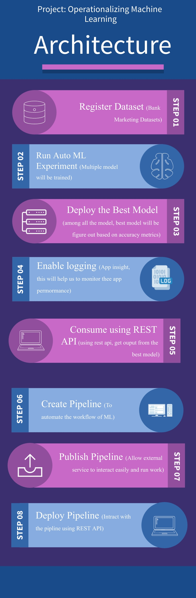

## Key Steps
#### Step 1:

Firstly, we have to register the dataset into the Azure ML Studio to run the Auto ML. I named the datasets as **Bank-marketing**

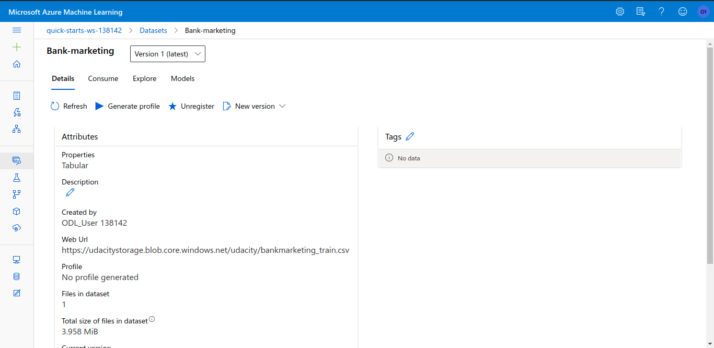


#### Step 2:

Next step, now we can run auto ML experiments. During this experiments we need to do following

1. Create a computer cluster 
2. Run the experiment using classification and select the Explaining Best Model


When the run complete, we can get all the details including the best model.

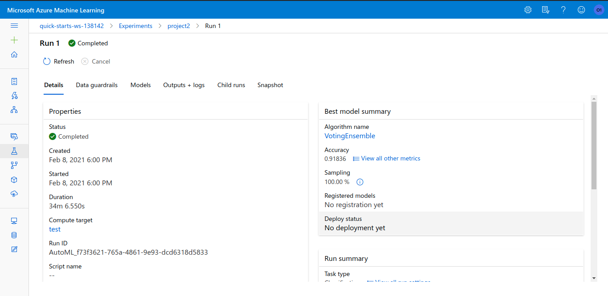


Like, this picture we can see the auto ml experiment is completed. We all so get the best Model. Here the best model is **VotingEnsemble** which works by combining the predictions from multiple models. And the accuracy 92%. 

If we move to models tab, we can see more information about differents for example the second best model **XGBoostClassifier** which accuracy is 91.56 %.

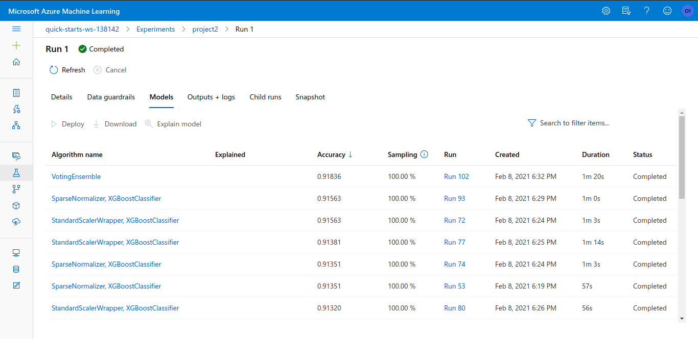


#### Step 3:

Now time for deployment, we have to deploy our best model. In azure one click deployment available. During deployment we need to enable **authentication** and we have to deploy in **Azure Container Instance**. When deployment is successful, we get additional details from deployment options.

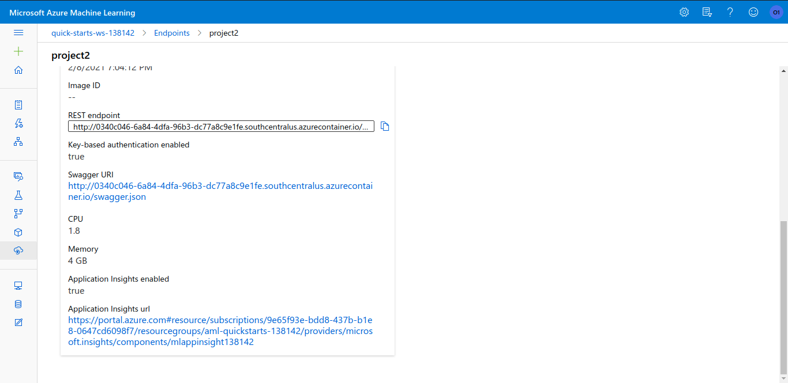

We can see in this image, the rest api endpoint is available. Azure also provide Swagger Option. To see the Swagger UI, we need to download the swagger.json and put in the same folder of these two file

1. swagger.sh
2. serve.py

After that we have to run this two command

```
bash swagger.sh
```

```
python serve.py
```

Now if we visit the http://127.0.0.1:85 we will a nice UI like this. But we have to replace the swagger json file.


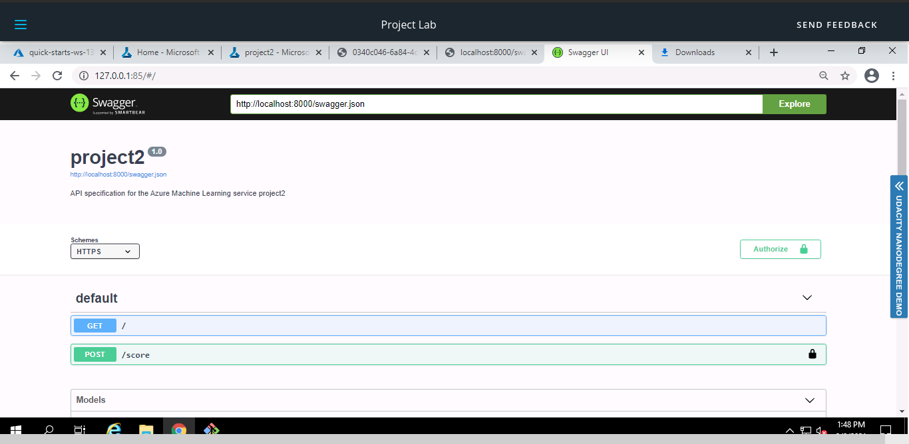

**Note: Here I change the default port, I serve into port 85.**

```
docker run -p 85:8080 swaggerapi/swagger-ui
```


Using this swagger UI, we can easily get the information that we need to send with the http call, and also sample output from the Rest Server.

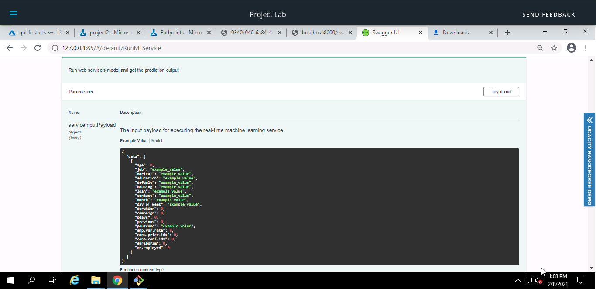


#### Step 4:

Enable logging: To enable logging we will use python ML Azure SDK and enable logging. To do this we need to down the config.json file from the workspace. Then we can run the below python script.

```python
from azureml.core import Workspace
from azureml.core.webservice import Webservice

# Requires the config to be downloaded first to the current working directory
ws = Workspace.from_config()

# Set with the deployment name
name = "project2"

# load existing web service
service = Webservice(name=name, workspace=ws)

# enable application insight
service.update(enable_app_insights=True)

logs = service.get_logs()

for line in logs.split('\n'):
    print(line)
```

To run this, in the terminal we can use this command (here script name logs.py)

```
python logs.py
```

Output:

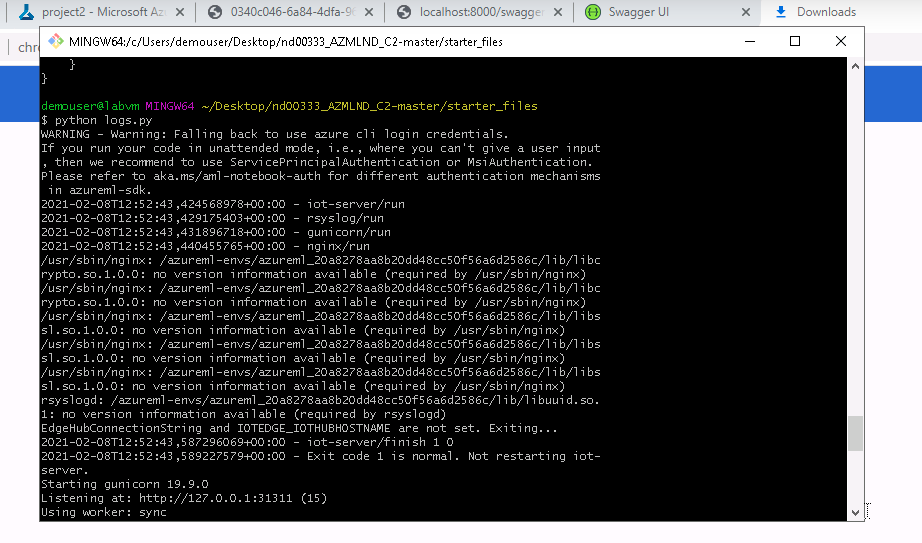

Now If we go back to the azure website and in the deployment, we will see the the Application Insights enabled and we have an option to see the insights by clicking the URL.

 


#### Step 5:

Consume the API model: Now time for testing our deployed model. To do the testing we need the rest api endpoint and the api key. We can get the from deploy details (STEP 3) and to get the api key, click on the consume tab and there we will find a primary key.

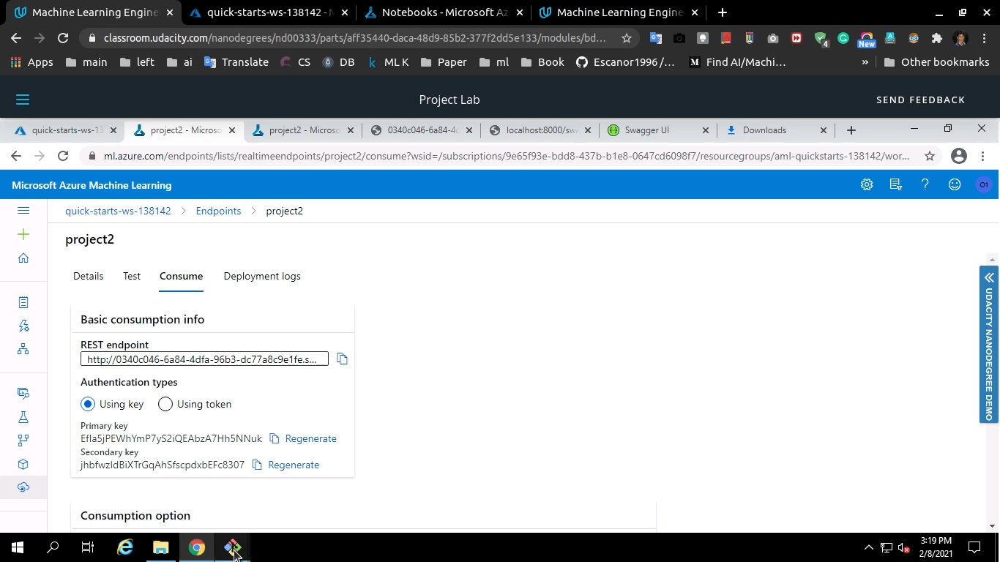


To do the testing, we will below script

```
import requests
import json

# URL for the web service, should be similar to:
# 'http://8530a665-66f3-49c8-a953-b82a2d312917.eastus.azurecontainer.io/score'
scoring_uri = 'http://0340c046-6a84-4dfa-96b3-dc77a8c9e1fe.southcentralus.azurecontainer.io/score'
# If the service is authenticated, set the key or token
key = 'EfIa5jPEWhYmP7yS2iQEAbzA7Hh5NNuk'

# Two sets of data to score, so we get two results back
data = {"data":
        [
          {
            "age": 17,
            "campaign": 1,
            "cons.conf.idx": -46.2,
            "cons.price.idx": 92.893,
            "contact": "cellular",
            "day_of_week": "mon",
            "default": "no",
            "duration": 971,
            "education": "university.degree",
            "emp.var.rate": -1.8,
            "euribor3m": 1.299,
            "housing": "yes",
            "job": "blue-collar",
            "loan": "yes",
            "marital": "married",
            "month": "may",
            "nr.employed": 5099.1,
            "pdays": 999,
            "poutcome": "failure",
            "previous": 1
          },
          {
            "age": 87,
            "campaign": 1,
            "cons.conf.idx": -46.2,
            "cons.price.idx": 92.893,
            "contact": "cellular",
            "day_of_week": "mon",
            "default": "no",
            "duration": 471,
            "education": "university.degree",
            "emp.var.rate": -1.8,
            "euribor3m": 1.299,
            "housing": "yes",
            "job": "blue-collar",
            "loan": "yes",
            "marital": "married",
            "month": "may",
            "nr.employed": 5099.1,
            "pdays": 999,
            "poutcome": "failure",
            "previous": 1
          },
      ]
    }
# Convert to JSON string
input_data = json.dumps(data)
with open("data.json", "w") as _f:
    _f.write(input_data)

# Set the content type
headers = {'Content-Type': 'application/json'}
# If authentication is enabled, set the authorization header
headers['Authorization'] = f'Bearer {key}'

# Make the request and display the response
resp = requests.post(scoring_uri, input_data, headers=headers)
print(resp.json())
```

In this script, we are sending the request to our REST service with some data that required for prediction. To run this script, we can use bellow command in the terminal (script saved as endpoints.py)

```
python endpoints.py
```

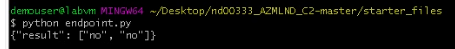


I also run the apache benchmark, to the server status And I found, the server working well, I get 0 failed response.

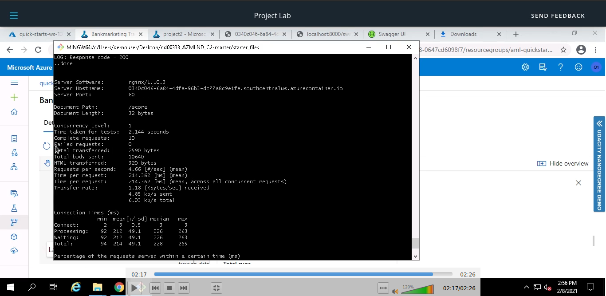


#### Step 6:

To automate the work flow we can create and publish pipeline that will allow external services to interact with it so that we can do the work more efficiently. To create pipeline, we used python Azure ML SDK.

To do, first we will create an azure ML experiment, to create the azure ml experiment we will use following configuration.

```python
automl_settings = {
    "experiment_timeout_minutes": 20,
    "max_concurrent_iterations": 5,
    "primary_metric" : 'AUC_weighted'
}

automl_config = AutoMLConfig(
		compute_target=compute_target,
        task = "classification",
        training_data=dataset,
        label_column_name="y",   
        path = project_folder,
        enable_early_stopping= True,
        featurization= 'auto',
        debug_log = "automl_errors.log",
        **automl_settings)
```

Here, it's a classification task, that's why we use task as 'classification'. In our datasets the label column is 'y'. And we also enable enable stopping.


Now we will create the pipeline, and run all the auto ml. All the code can be found, it this [notebook](https://github.com/Iamsdt/Operationalizing-Machine-Learning/blob/main/aml-pipelines-with-automated-machine-learning-step.ipynb).

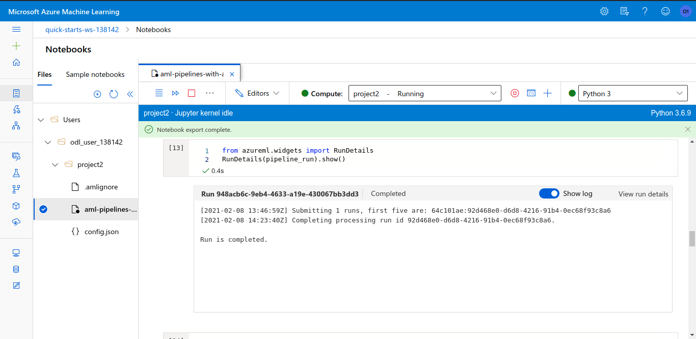

When auto ML experiment is complete, we can get the best model details, here is an example about 

**XGBoostClassifier**

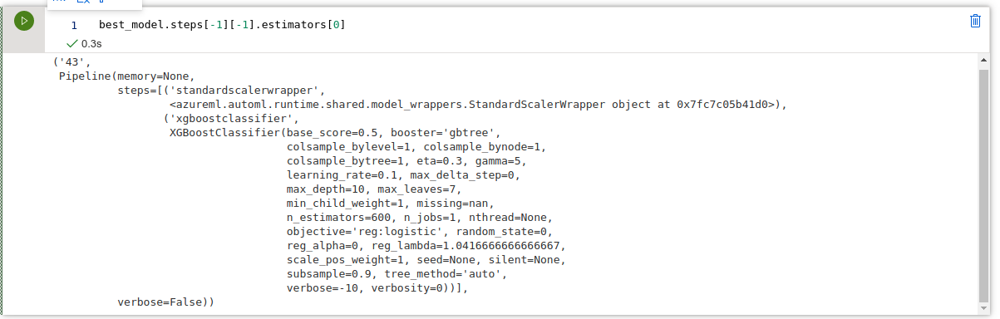

Now time for publish the pipeline and rest endpoints (all the code in [notebook](https://github.com/Iamsdt/Operationalizing-Machine-Learning/blob/main/aml-pipelines-with-automated-machine-learning-step.ipynb)). When we run the following cell, we will get this kind of output.

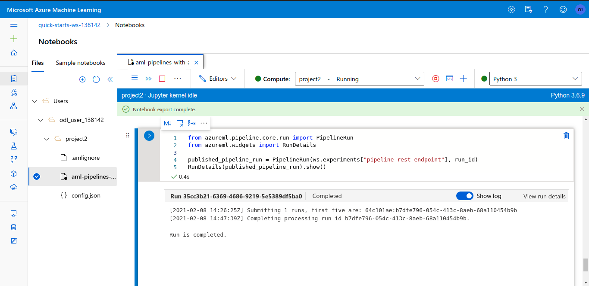


Now if we go to the pipeline options in ML azure ML studio. we will see the pipelines run completed

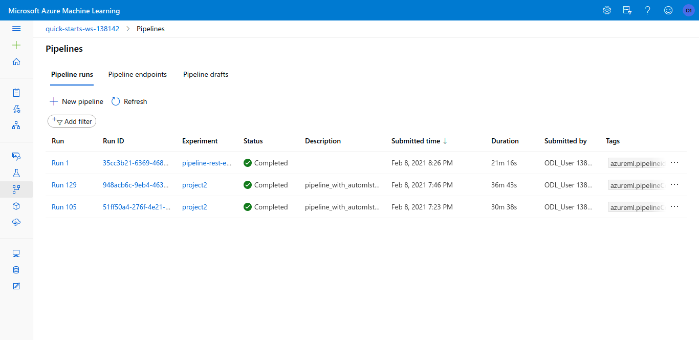

Now navigate into the **Pipeline End Points**, we can see one pipeline is created with rest end point and it's status is active

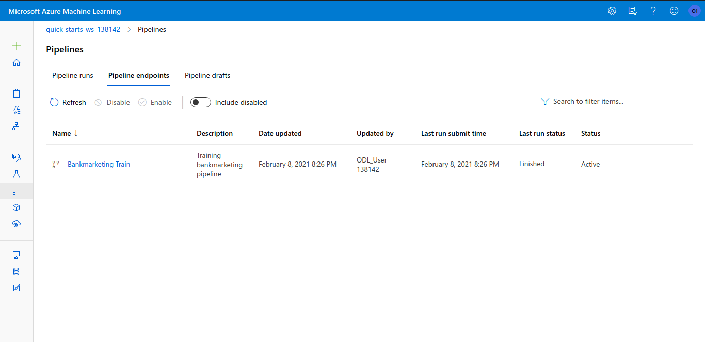

If we click the on the pipeline, it will open the details about pipeline, and we can get the rest endpoint about the pipeline

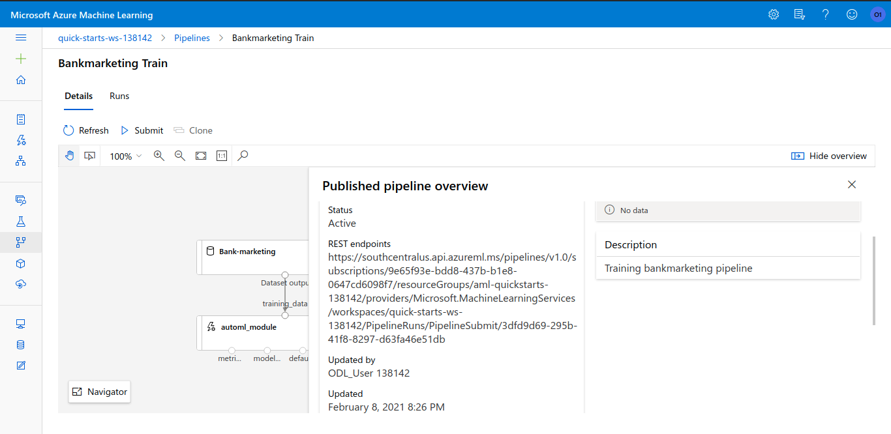

We can use this end points to interact with the pipeline.


## Screen Recording

Video is available on [Youtube.](https://www.youtube.com/watch?v=Eg0IMLuZeWY)


## Future work

1. - [ ] **Balance the datasets-**

   The first goal is to balance the datasets, that can be done by Re-sampling technique. Here we can use the following techniques

   - **Under-sampling**:

     We can use under-sampling technique to balances the dataset by reducing the size of the abundant class. But this method can be applied  when quantity of data is sufficient.

   - **Over-sampling**

     On the hand, we can use oversampling technique if we have insufficient data. we can balance dataset by increasing the size of rare samples instead of getting rid of abundant samples, new rare samples are generated by using e.g. repetition, bootstrapping or SMOTE (Synthetic Minority Over-Sampling Technique) .

   

2. - [ ] **Compare with different metrics**

   Next, we can use different metrics to deal with imbalance datasets, like 

   - **Precision**: how many selected instances are relevant.

   - **Recall**: how many relevant instances are selected.

   - **F1 score**: harmonic mean of precision and recall.

   - **MCC**: correlation coefficient between the observed and predicted binary classifications.

   - **AUC**: relation between true-positive rate and false positive rate.

     

3. - [ ] **Train Auto ML with Deep Learning**

   And the last, we can use deep learning to train the model, and check for any improvements.